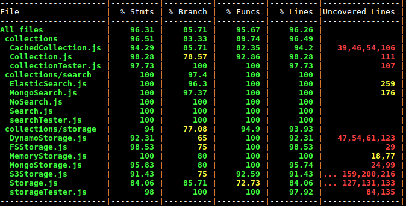

# Collections Boilerplate

Reduce variability in manipulation of small to medium sized collections across
all my node.js projects.
Can justify spending time on ad-hoc pipelines and stuff when collections become
very big.
However, until that actually happens, this should suffice.

Here is a simple model of how things are organised:

Keep it fully tested so it can be used across production projects as well as
prototypes.
Take a while to set up tests etc due to the nature of the library.
However, once you do, should be able to get pretty good coverage.

